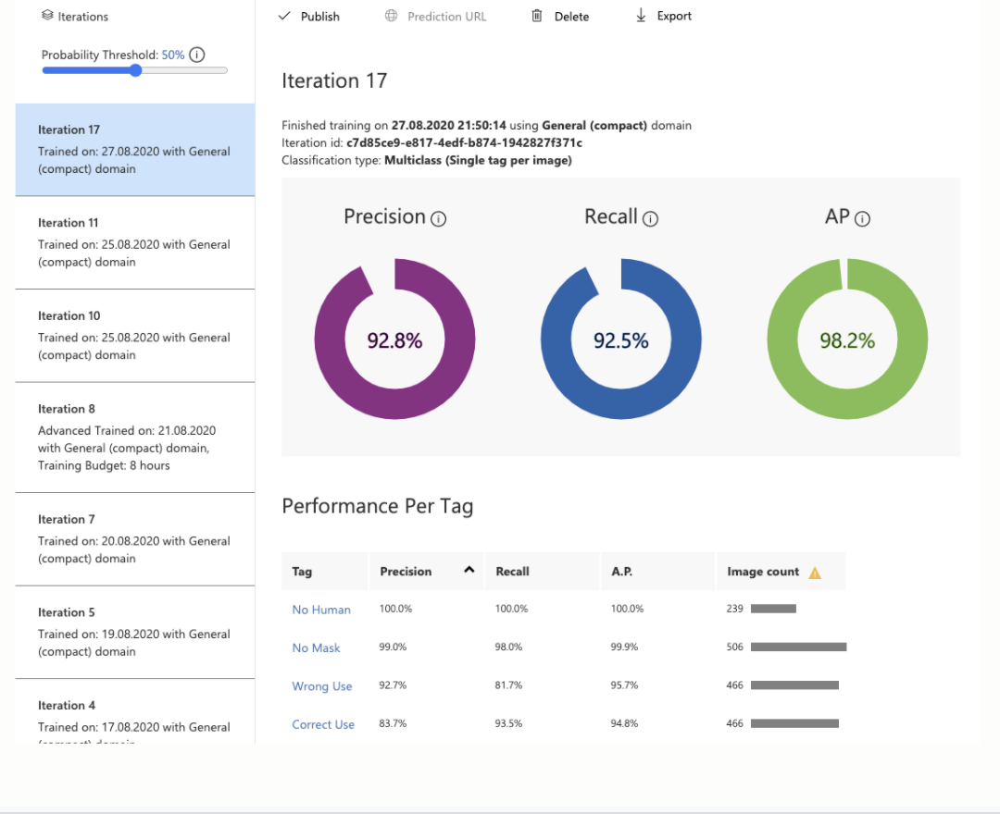

# Mask Detection

Face Mask Detection using Tensorflow/Keras OpenCV Transfer Learning 

# Up School

UP School is an ed-tech startup that boosts up women to become role models in technology. By helping women gain technical and collaborative success skills. This is a 4 months ed-tech program which provides you the best platform to improve soft skills and hard skills by involving students to variety projects . In this project term ,  I want to thank my mentors and Up School organization team for supporting me.

This is my capstone project happy coding ! 🥳

Face Mask Detection system based on computer vision concept with OpenCV, Keras/TensorFlow,MobileNetV2,VGG16.
 
[Useful Blog for pre-trained models](https://www.analyticsvidhya.com/blog/2020/08/top-4-pre-trained-models-for-image-classification-with-python-code/ "Pre-trained models for image classification")

# 🧐 Motivation

With occuring Covid-19, a new term joins our lives , mask ! It protects us from virus if we wear mask correctly. But not all people follow the rules.

There is no efficient face mask detection applications. 

Construct a classification model with images which 3 classes. 
'yes mask','no mask','wrong mask'.

Raise awareness of wearing mask in right way for world health.

Learn computer vision practise and neural networks.

# Dataset
The dataset used can be downloaded here - 

When I created dataset, I took photos of my face and our family's face. Thus, I can't put them on Github. Also, I collected photos from websites and I put them on folder.

This dataset consists of 1463 images belonging to three classes:

* The number of images with facemask labelled 'yes': 473 
* The number of images with facemask labelled 'wrong': 471 
* The number of images with facemask labelled 'no': 519

# 💻 Microsoft Azure Custom Vision

Before coding model with Tensorflow , I used Microsoft Azure Custom Vision service to construct image classification model. With exporting model as CoreML , I developed a iOS application. 

# Technology

* OpenCV 
* Keras 
* TensorFlow 
* VGG16 
* MobileNetV2 

# 🎥 Project Demo

# 🥁 Results

[For More Detail, My Capstone Project Presentation](https://docs.google.com/presentation/d/1tU_PQ9-1gAfVR5sHVfaVD9DXfO6zhk6se_z1RrVEgT4/edit?usp=sharing)

