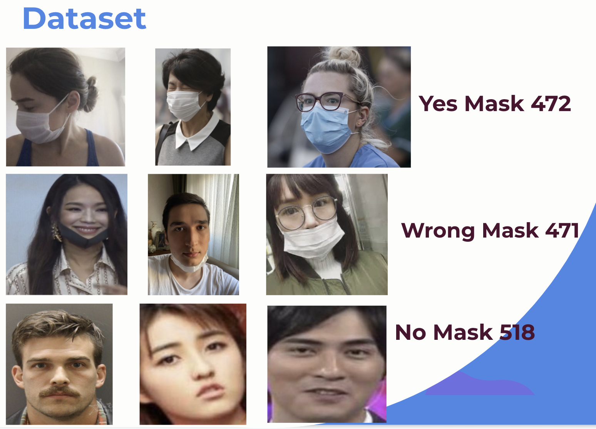

# Mask Detection

Face Mask Detection using Tensorflow/Keras OpenCV Transfer Learning 

# Up School

UP School is an ed-tech startup that boosts up women to become role models in technology. By helping women gain technical and collaborative success skills. This is a 4 months ed-tech program which provides you the best platform to improve soft skills and hard skills by involving students to variety projects . In this project term ,  I want to thank my mentors and Up School organization team for supporting me.

This is my capstone project happy coding ! 🥳

Face Mask Detection system based on computer vision concept with OpenCV, Keras/TensorFlow.

# 🧐 Motivation

With occuring Covid-19, a new term joins our lives , mask ! It protects us from virus if we wear mask correctly. But not all people follow the rules.

There is no efficient face mask detection applications. 

Construct a classification model with images which 3 classes. 
'yes mask','no mask','wrong mask'.

Raise awareness of wearing mask in right way for world health.

Learn computer vision practise and neural networks.

# Dataset

# 🎥 Project Demo

